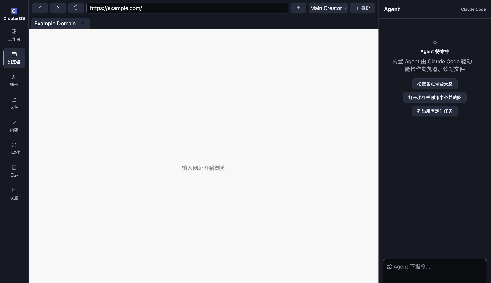
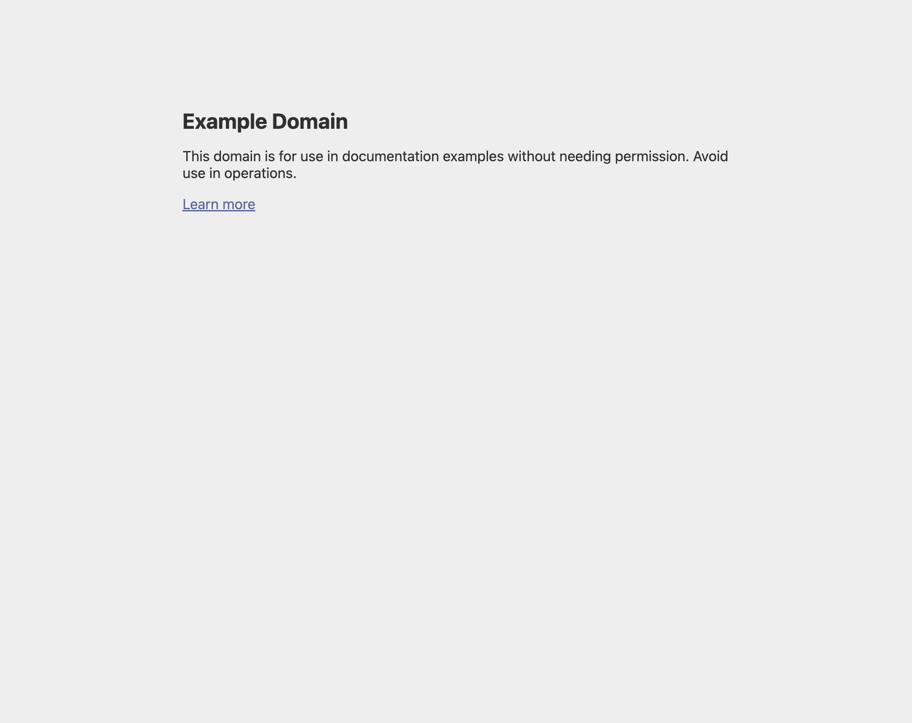
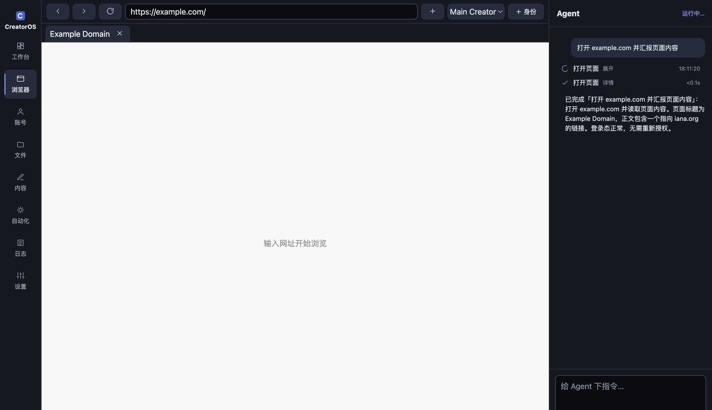
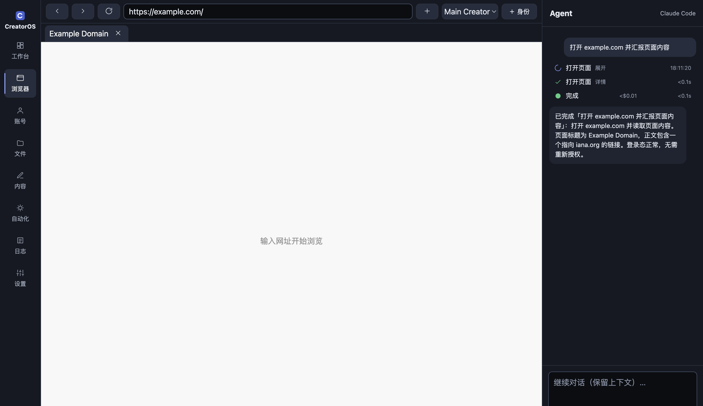
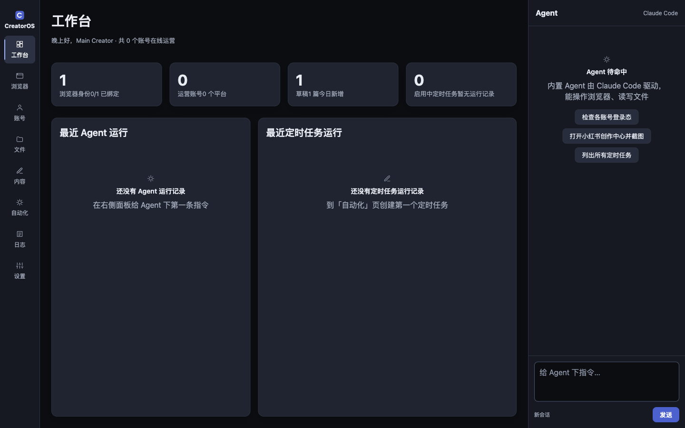
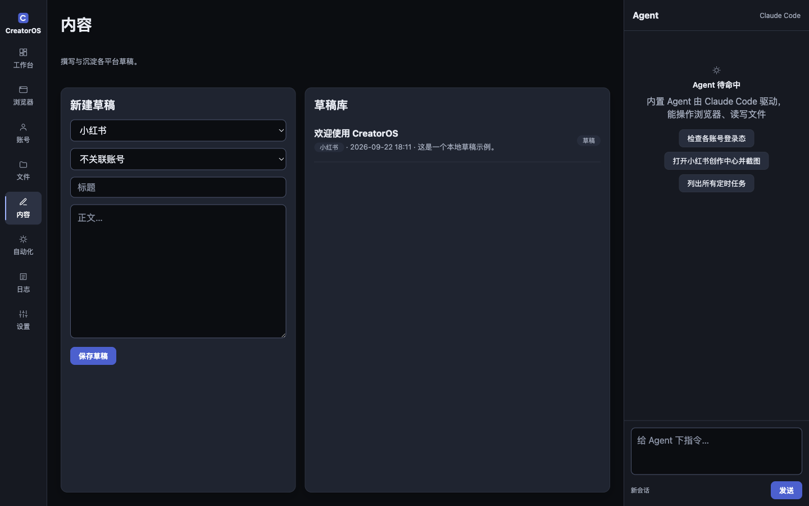
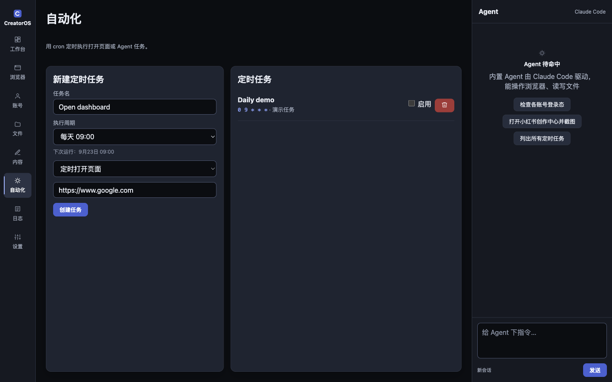
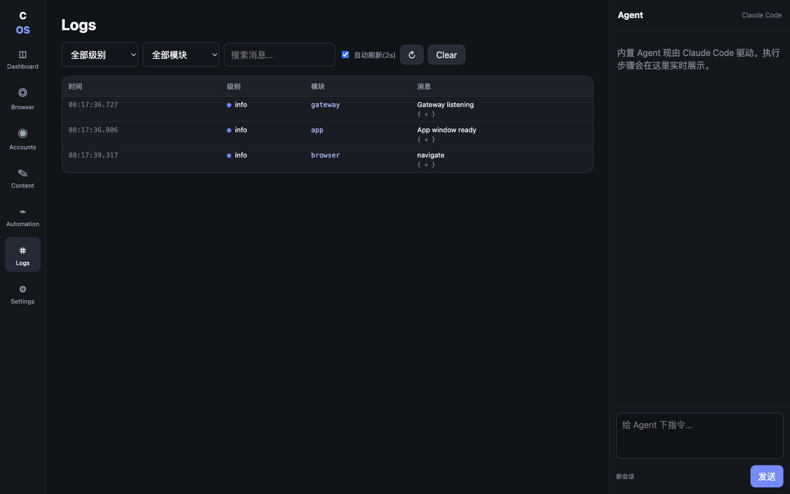
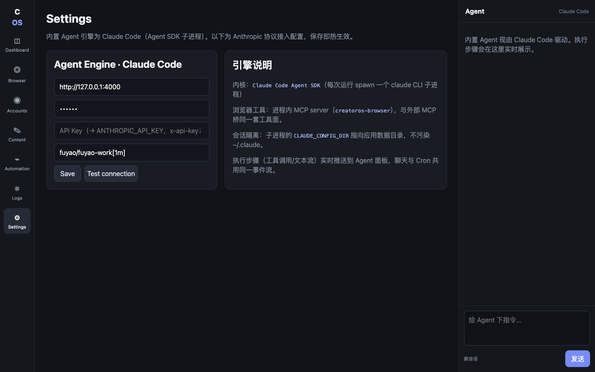
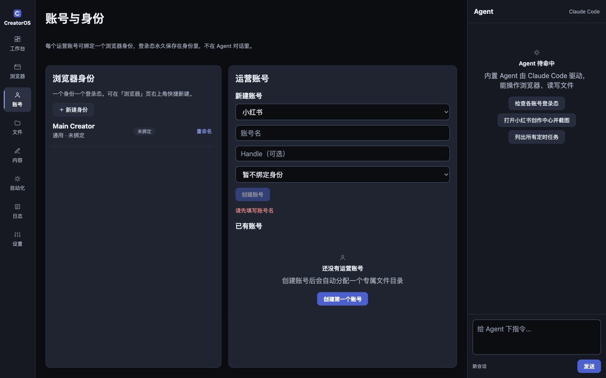

# CreatorOS v0.5

[中文说明 / 中文版 README](./README_CN.md)

Local-first AI creator operations workspace. The defining property of this MVP is a **persistent browser runtime embedded inside the desktop app**: Electron `WebContentsView` + `persist:` profile sessions + a main-process BrowserKernel. Agents, cron jobs and external bots operate that same internal browser runtime.

## Screenshots

| Browser workspace | Embedded page (agent-controlled) |
|---|---|
|  |  |

The embedded `WebContentsView` renders inside the app window (left); the agent panel on the right streams every step of a Claude Code run as it operates that same browser (right image: the active tab's content captured by the BrowserKernel).

**Agent panel — live step stream** (Claude Code kernel, chat and cron jobs share the same engine):

| Running | Finished |
|---|---|
|  |  |

Each tool call shows with a friendly Chinese label (打开页面 / 读取页面 / 点击 …) plus the raw `browser_*` name in its expandable JSON, its result as a ✓/✗ row with duration, assistant text streams in as a typewriter, and the run ends with a cost + wall-time line (sub-cent costs collapse to `<$0.01`). A stop button interrupts mid-run; follow-up messages resume the same session.

**Pages (Chinese-first UI, v0.4 redesign):**

| 工作台 Dashboard | 内容 Content |
|---|---|
|  |  |

| Automation (cron, incl. `agent.run`) | Logs |
|---|---|
|  |  |

| Settings (agent engine) | Accounts |
|---|---|
|  |  |

> Screenshots are regenerated with `npx tsx scripts/capture-readme.mts` (offline, fake agent mode).

## Included

- Electron 44 + React + TypeScript + Vite
- Real embedded `WebContentsView` browser workspace
- Persistent browser profiles/session partitions
- Multi-platform account management with account → persistent profile binding
- Multi-profile and multi-tab BrowserKernel, including internal handling of `window.open`/OAuth popups
- Semantic page snapshot + `click(ref)` / `fill(ref)` / upload / scroll / screenshot / evaluate primitives
- CDP attach escape hatch (`webContents.debugger`)
- SQLite using Node's built-in `node:sqlite` + Drizzle schema/repository
- Content draft management
- Persisted cron jobs + scheduler, including `agent.run` jobs that hand a scheduled prompt — or a bound **skill** — to the same agent engine as the chat panel
- **Skills system**: reusable prompt templates (name + description + instruction), created manually in the UI or by the agent itself (agent-created skills are badged for review); run from the agent panel, a Run button, or bound to a cron job by `skillId` reference (template updates propagate; deleting a skill fails its bound jobs loudly)
- **Full-capability agent tools** (second in-process MCP server `creatoros-app`, 10 tools): list/create/toggle/delete cron jobs, list/create/update content drafts, list accounts, list/create skills — the agent can now operate the whole app, not just the browser; cron validation is unified to the strict `parseCron` caliber across UI/Gateway/tools
- Local Fastify gateway and Feishu webhook skeleton
- Claude Code Agent SDK kernel (`@anthropic-ai/claude-agent-sdk`): per-run `claude` CLI subprocess with browser tools served by an in-process SDK MCP server (15 `browser_*` tools bound to BrowserKernel)
- Live agent step stream: SDK stream messages translated to typed steps (tool start/result with duration, text deltas, done with cost/duration) pushed over IPC to the agent panel
- MCP v2 stdio bridge to the running app (15 browser tools + a read-only quartet: job/content/account/skill lists — write and destructive tools are deliberately NOT exposed over the bridge)
- Hardened preload IPC boundary
- Technical design DOCX under `docs/`

## Quick start

```bash
cp .env.example .env
npm install
npm run dev
```

The first launch seeds one persistent profile, one sample draft and one disabled demo job.

### If you prefer pnpm

```bash
corepack enable
pnpm install
pnpm dev
```

## Browser persistence

`ProfileManager` maps each profile to a stable Electron partition such as `persist:profile-xxxx`. Electron stores cookies, cache and site storage for that partition under the application's user-data directory. CreatorOS reuses that partition on every launch.

The project intentionally does **not** launch Google Chrome, Playwright Chromium or a headless browser.

## Agent engine configuration

The internal agent is a Claude Code Agent SDK run: every run spawns a `claude` CLI subprocess speaking the Anthropic protocol. Configure the endpoint on the Settings page (saved to SQLite, applied to the next run without a restart) or via environment variables as the startup default:

```env
ANTHROPIC_BASE_URL=https://api.anthropic.com   # or an Anthropic-protocol relay/gateway
ANTHROPIC_AUTH_TOKEN=...                        # Authorization: Bearer (takes precedence)
ANTHROPIC_API_KEY=...                           # x-api-key header
ANTHROPIC_MODEL=claude-sonnet-4-5
```

Settings-page values win over environment variables. `ANTHROPIC_AUTH_TOKEN` and `ANTHROPIC_API_KEY` are alternatives; the token wins when both are set. Use the Settings page 测试连接 (Test connection) button to run a minimal query against the current config.

## Local gateway

Default: `http://127.0.0.1:17890`. All endpoints except `/health` require `Authorization: Bearer <CREATOROS_GATEWAY_TOKEN>`.

```bash
curl http://127.0.0.1:17890/health
curl -H 'Authorization: Bearer change-me' http://127.0.0.1:17890/api/state
```

## MCP

Two paths expose the same `browser_*` tool semantics bound to the single BrowserKernel runtime:

- **In-process SDK MCP server** (`creatoros-browser`): the internal agent's tool surface — 15 `browser_*` tools served to the spawned `claude` subprocess via `createSdkMcpServer`, no network hop.
- **External stdio bridge** for outside clients (Claude Code, Claude Desktop, any MCP host): the app must be running, then:

```bash
CREATOROS_GATEWAY_TOKEN=change-me npm run mcp
```

See `docs/MCP.md`.

## MVP boundaries / TODO

This repository is a runnable foundation, not a finished commercial publisher. Before using it for unattended posting, add platform-specific adapters, confirmation gates, robust selector strategies, download/upload tooling, encrypted secret storage (engine keys are currently plain JSON in SQLite), Feishu signature verification, migrations/versioning and per-platform observability.

## Docs

- `docs/CreatorOS_技术设计文档_v0.1.docx`
- `docs/ARCHITECTURE.md`
- `docs/DEVELOPMENT.md`
- `docs/SECURITY.md`
- `docs/MCP.md`
- `docs/API.md`
- `docs/DATABASE.md`
- `docs/VERIFICATION.md`
- `docs/QUICKSTART_CN.md`
- `docs/USAGE_CN.md`
- `docs/WORKFLOW_CN.md` (R&D workflow, R0–R5)
- `docs/DEVELOPMENT_PLAN_CN.md` (milestones)
- `docs/CODE_REVIEW_v0.3.md` (v0.3 code review: 10 findings, prioritized)
- `docs/specs/` (per-feature R0–R4 artifacts: requirement, UI, architecture, dev report, test report)
